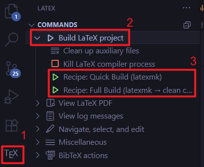
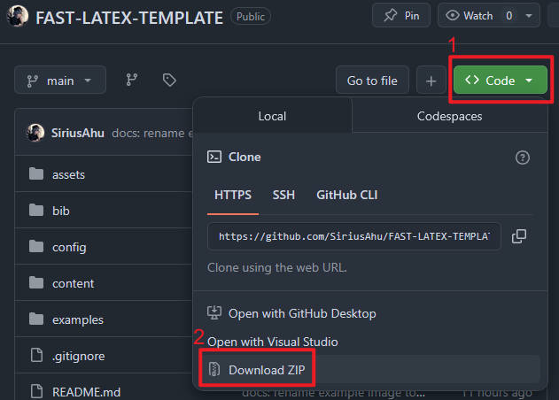
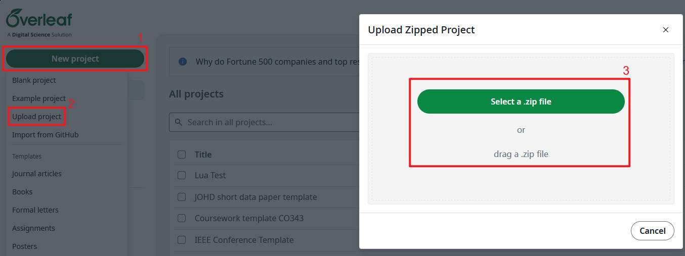
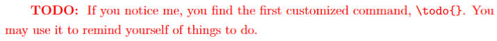
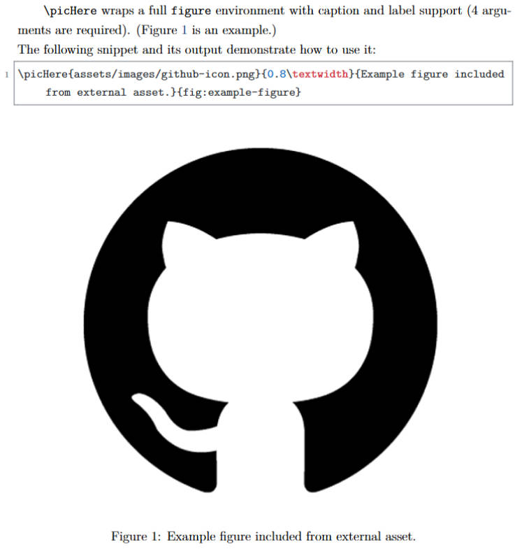
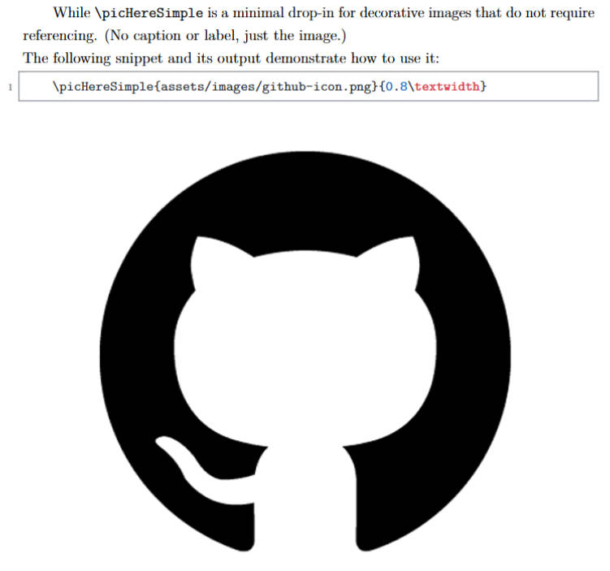

<div align="center">
  
  <h1>FAST: 一款快速上手的 LaTeX 模板（适用于学校CW）</h1>
</div>

<div align="center">

<!-- XeLaTeX, BibTeX, listings -->


</div>

<div align="center">

[](https://www.gnu.org/licenses/gpl-3.0)

[](https://code.visualstudio.com/)

</div>

<div align="center">

[**English**](./README_EN.md) | [**简体中文**](./README.md)

</div>

# 写在前面：关于这个项目

> 我在大二的时候接触了 LaTeX，并惊讶于其的优雅与强大。
> 由于学校的课程作业（Coursework，简称CW）大多要求提交PDF格式的报告，而Word等传统工具在排版数学公式、插入代码等方面显得力不从心，于是我决定写一个 LaTeX 模板来帮助自己和同学们更方便地使用 LaTeX 来制作一份美观的报告。
> 
> 说干就干，我确实制作了一个仓库！它就是[XJTLU-TC_Latex_Coursework_Template](https://github.com/SiriusAhu/XJTLU-TC_Latex_Coursework_Template)。
> 
> 然而，随着时间的推移，和自身经验的积累，我发现这个模板并没有我想的那么好用、易用，同时也越来越不能让我自己满意了。
> 
> 于是，本着**FAST**，**Accessible**，**Stylish**，**Toolkit**的理念，我重新设计了 **[FAST](https://github.com/SiriusAhu/FAST-CW-LATEX-TEMPLATE)**，这一全新模板！
> 
> 希望它能帮到你，也希望你能喜欢它！😉
>
> Made with [Codex](https://openai.com/codex/) and [Github Copilot](https://github.com/features/copilot)

# 效果展示

用该模板编译的PDF文件也一并上传到了仓库中，详细效果请查看[main.pdf](./main.pdf)。

# 简介

**[FAST](https://github.com/SiriusAhu/FAST-CW-LATEX-TEMPLATE)** 是一个致力于方便学生使用`LaTeX`进行作业报告写作的模板，支持本地与在线平台（如`Overleaf`），支持中英文，易于上手，开箱即用。

[点击这里跳转到使用方法](#使用方法)。

## 🚨 BREAKING CHANGE 🚨
该项目的核心编译引擎已从`pdfLaTeX`切换为`XeLaTeX`，参考文献处理链也从`biblatex + biber`切换为经典的`BibTeX`。

详情请参阅[CHANGELOG.md](./CHANGELOG.md)。


## 主要特性

- [x] 支持数学公式、表格绘制、代码高亮、参考文献等常见核心需求
- [x] 模块化设计，便于定制和扩展
- [x] 配置需求简单，开箱即用
- [x] 同时支持本地与在线平台（如`Overleaf`）

## 支持的编译环境

- ✅ 本地 TeX Live / MiKTeX 等发行版（使用 `XeLaTeX`）
- ✅ `Overleaf` 平台（在菜单中选择 `XeLaTeX` 编译器）
- ⚠️ 模板现已针对 `XeLaTeX` 做优化；如需 `pdfLaTeX`、`LuaLaTeX` 等其他引擎，请自行扩展配置

<!-- TODO:贴上效果图 -->

## **FAST**的哲学

本项目本着：

- **Fast**：核心——快捷的编译！
    > 不用再浪费时间找模板了！用它，立刻开始写 Coursework！
- **Accessible**：开箱即用，方便上手！
    > 兼容大多环境，提供自定义命令，以及直接可用的 `VSCode` 配置！
- **Stylish**：美观，无需多言！
    > 是的，用眼睛感受，无需多言😎
- **Toolkit**：适合CW，实用，够用！
    > 数学公式？三线表？代码高亮？参考文献？你需要的，它都有！


## 核心工具

- `XeLaTeX`：现代 `LaTeX` 引擎，原生 Unicode 支持，字体配置灵活。
- `BibTeX`：经典参考文献处理链，命令简单、编译迅速。
- `listings`：一个经典、可靠、快速的代码高亮工具。
- `xeCJK`（可选）：针对 `XeLaTeX` 的中文支持宏包（默认关闭以保持轻量）。
- `cleveref`：智能交叉引用工具，自动识别图、表、公式等。
- `booktabs`, `amsmath`, `graphicx`等：一系列 `LaTeX` 默认生态下的经典优秀宏包。

> ⚠️ **提示**：模板默认启用 `xeCJK` 并自动在常见字体中择优选择。如需强制指定字体，可在 `config/preamble.tex` 中调整 `\TemplateSetupCJKFonts` 内的候选列表。

> ⚠️ **提示**：模板支持使用 `TikZ` + `PGFPlots` 等绘图工具，但这些包较为复杂且会显著延长编译时间。如需使用，请在 `config/preamble.tex` 中手动添加相关宏包。

## 项目目录结构

```
fast-cw-latex-template/
│
├── .vscode/
│   └── settings.json       # VSCode LaTeX Workshop 配置
│
├── assets/                 # 静态资源
│   ├── code/
│   │   ├── example.py
│   │   └── example.cpp
│   ├── images/
│   │   └── logo.png
│   └── coverpage.pdf       # 作业封面（一些课程作业会提供）
│
├── bib/
│   └── references.bib      # 参考文献
│
├── config/
│   ├── commands.tex        # 自定义命令与环境
│   ├── preamble.tex        # 宏包引入与全局配置
│   └── style.tex           # 视觉风格（颜色、标题、页眉页脚）
│
├── content/
│   ├── 01-introduction.tex
│   ├── 03-math.tex
│   ├── 04-figures.tex
│   ├── 05-tables.tex
│   ├── 07-code.tex
│   ├── 08-references.tex
│   └── appendix.tex
│
├── docs/                   # 文档（待完善）
├── examples/               # 示例文件（待完善）
├── .gitignore              # Git忽略文件
├── LICENSE                 # 许可证（GPLv3）
│
├── main.pdf                # 输出的PDF
├── main.tex                # 总入口文件
├── meta.tex                # 元信息（题目/作者/日期/摘要等）
├── options.tex             # 用户选项（主题色、代码风格等）
│
├── README_EN.md            # 说明文档（英文）
└── README.md               # 说明文档（中文）
```

# 使用方法

本项目支持本地编译（推荐使用`VSCode`）和在线平台（如`Overleaf`）编译两种方式。

## A. 本地使用 with VSCode

### A.0.1. 环境检查
<!-- TODO:使用虚拟机测试Windows和Linux下的完整安装流程 -->

先验证一下`Tex Live`和核心工具是否已经安装在设备上。

```bash
tex --version      # 验证 TeX Live 成功安装
xelatex --version  # 验证 XeLaTeX 成功安装
bibtex --version   # 验证 BibTeX 成功安装
```

如果没有安装的话，请安装 [**Tex Live 2024**](https://www.tug.org/texlive/) 或更新版本（旧版本未测试）。

<!-- TODO: 测试、适配 Overleaf -->
<!-- > 不过别担心，该项目也支持在 `Overleaf` （一个热门的在线 `LaTeX` 编辑器）上使用。 -->

### A.0.2. VSCode相关配置

该项目自带了一个`.vscode/settings.json`配置文件。如果你使用`VSCode`作为编辑器，它会直接覆盖默认的用户配置生效。（这样你就不用浪费时间在各种额外配置上了！😎）

> Q: 如果我不想用你的配置怎么办？
> 
> A: 如果你有自己的一套配置，不想用仓库中的配置，那么你可以选择删除`.vscode`文件夹，或者将其重命名为其他名字（如`.vscode_backup`）。这样它就不会覆盖默认的用户配置了。

### 1. 克隆或下载该项目

```bash
git clone https://github.com/SiriusAhu/FAST-LATEX-TEMPLATE.git
cd FAST-LATEX-TEMPLATE
```

或者直接下载ZIP包并解压。

### 2. 编辑`meta.tex`和`options.tex`

按照需求修改即可。
- `meta.tex`：填写作业的元信息，包括但不限于：
    - 课程代码
    - 课程名称
    - 作者名称
    - 作者学号
    - Coverpage的路径
    - 封面页图片路径及其大小
    - 摘要
- `options.tex`：根据个人喜好调整以下设置：
    - 主题色、代码风格等选项
    - **中文支持**：默认开启并自动匹配常见字体，如需指定特定字体，可编辑 `config/preamble.tex` 中的 `\TemplateSetupCJKFonts`
    - **参考文献样式**：新增 `\TemplateBibStyle` 选项用于选择引用样式。例如：
        - `ieee`（默认）
        - `apa7`（对应 biblatex 的 `apa` 样式）

### 3. 尝试编译

试试看编译是否能成功：渲染是否报错？输出的PDF文件上的元信息是否与`meta.tex`中填写的一致？

#### 3.1. 使用命令行编译

编译链条：`XeLaTeX -> BibTeX -> XeLaTeX -> XeLaTeX`。

```bash
xelatex main.tex
bibtex main
xelatex main.tex
xelatex main.tex
```

#### 3.2. 使用VSCode编译

安装`LaTeX Workshop`扩展，然后使用`VSCode`打开项目文件夹，点击左侧扩展栏中的`TeX`图标，选择`Build LaTeX project`下的`Full Build`进行编译。



## B. 在线使用 with Overleaf

> **[FAST](https://github.com/SiriusAhu/FAST-CW-LATEX-TEMPLATE)** 在初步完善后会上传到`Overleaf`的官方模板仓库（[Overleaf Gallery](https://www.overleaf.com/gallery)），届时你可以直接在`Overleaf`上使用它。
> 🚧 目前仍在测试阶段。

你可以将本项目作为压缩包下载，之后上传到`Overleaf`。（见以下两张图片）





## 一切就绪，开始写作吧！

> 🎉 **[FAST](https://github.com/SiriusAhu/FAST-CW-LATEX-TEMPLATE)** 在`VSCode`环境下提供了两个recipe（构建流程），默认的是`Full Build`，速度稍慢但功能全面。如果在意速度可手动切换使用`Quick Build`，其没有引用的支持（图片、文献），但是速度非常快。

**[FAST](https://github.com/SiriusAhu/FAST-CW-LATEX-TEMPLATE)** 使用了模块化设计，正文章节内容都放在了`content/`文件夹中，而它们统一被`main.tex`文件调用。

比如说，一个`content/01-introduction.tex`文件可以在`main.tex`中被如下代码调用：

```latex
\input{content/01-introduction.tex}
```

`content`下的文件并非固定的，你可以根据需要添加、删除、重命名这些文件并在`main.tex`中进行相应的调用即可。


# 自定义命令

目前在文中的主要自定义命令包括：

- `\TODO{ ... }`: 用红色字体在正文中标记待办事项
    
    

- `\picHere{path}{width}{caption}{label}`: 插入图片
    - `path`: 图片路径
    - `width`: 图片宽度（如 `0.8\textwidth`）
    - `caption`: 图片标题（显示在图片下方）
    - `label`: 图片标签（用于交叉引用）
    
    

- `\picHereSimple{width}{path}`: 简化版插入图片（无标题和标签）
    - `width`: 图片宽度（如 `0.8\textwidth`）
    - `path`: 图片路径
    
    

TODO: 制作专门的自定义命令的文档，以及跳转链接

# Q&A
- 为什么模板现在改为强制使用 `XeLaTeX`？
    1. **跨平台字体体验**：`XeLaTeX` 原生支持 Unicode 和系统字体，更容易满足“导入学校官方字体/多语言混排”等课堂作业场景。
    2. **设备适配更广**：学校机房、同学电脑以及 Overleaf 等平台都已默认支持 `XeLaTeX`，迁移成本比早些年低得多。
    3. **功能和速度的平衡**：虽然比 `pdfLaTeX` 稍慢，但换来的是更强的功能（OpenType、emoji、右左书写等），完全值得这点时间差。
- 为什么从 `biblatex + biber` 切换回了经典的 `BibTeX`？
    1. **使用场景反馈**：大多数同学只需要十几条参考文献，难以触及 `biblatex` 的优势区间。
    2. **编译时间敏感**：`BibTeX` 链路更短，尤其在 Overleaf 免费版 10s 限时下能够显著降低首编失败率。
    3. **门槛更低**：`BibTeX` 不需要额外的 `.bcf/.run.xml` 文件，也更容易通过命令行或 VSCode Recipe 理解和排障。
- 为什么使用`listings` 而不是 `minted`？
    1. **安装和使用更简单**：`minted` 依赖 Python 和 Pygments，安装和配置需要额外的操作，不符合该项目“易用”的初衷。而 `listings` 可以做到开箱即用。
    2. **编译速度更快**：`minted` 需要在编译时调用外部程序，导致编译速度变慢。而 `listings` 是纯 LaTeX 宏包，编译速度更快。

# 已知issue
1. “配置文件中明明使用的是`.vscode/settings.json`下的recipe，同时设置了在保存时自动编译。但我发现每次保存时系统却会使用其他的recipe进行编译。这是怎么回事？”
    - 诊断：有可能你已经在默认的配置文件下进行过有关`"latex-workshop.latex.recipe.default"`的设置。
    - 解决方案：将配置文件中的`"latex-workshop.latex.recipe.default"`改为`"lastUsed"`（不影响在其他项目中的使用），或者直接注释掉（可能影响在其他项目中的使用）。
2. “为什么我编译后的PDF文件中没有引用？（是用的是`VSCode`）”
    - 诊断：有可能是你使用的是项目给出的默认recipe，“Quick Build”，其不包含`bibtex`的调用。
    - 解决方案：手动点击选择扩展栏中的`Full Build`这一recipe进行编译就好啦。
3. ”为什么我在`Overleaf`中使用这个模板时出现了编译超时问题？这不是一个注重编译速度的模板吗？”
    - 根据[这个网页](https://www.overleaf.com/blog/changes-to-free-compile-timeout)，由于营收问题，从2025.06开始`Overleaf`对免费用户的编译时间限制降为**10s**。而首次编译由于需要初始化则可能会超时。
    - 解决方法：只需要再尝试重新编译2、3次，或者尝试刷新即可恢复正常。

# TODO
- [x] 将`LaTeX`模板模块化
- [x] 完成英文`README.md`
- [ ] 创建`docs`文件夹，放置文档和示例
- [ ] 给出一些伪作业的examples，以便展示潜力（欢迎使用该模板并提交PR到examples中！）

# 图片预览

