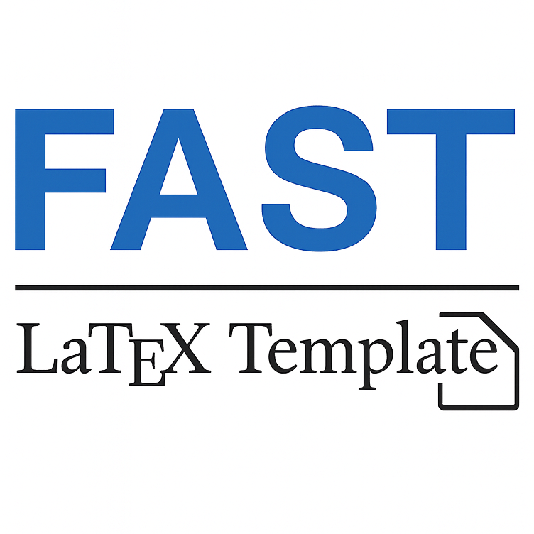

  
  <h1>FAST: 一款快速上手的 LaTeX 模板（for XEC 2025 AIAC FYP Proposal）</h1>

<!-- PDFLaTeX, Biber, BibLaTeX, listings -->

[**English**](./README_EN.md) | [**简体中文**](./README.md)

# 简介

这是[**FAST**](https://github.com/SiriusAhu/FAST-LATEX-TEMPLATE)项目的一个专门分支，根据西交利物浦大学（XJTLU）太仓校区（XEC）2025年AIAC专业的本科毕业设计（FYP）提案MS Word模板所制作的LaTeX模板。基本复刻了原始Word模板的格式和要求，方便同学们使用LaTeX撰写FYP Proposal。

> ⚠️ 大部分原项目中的功能仍然保留，不过部分功能在此分支中被移除或简化，以更好地符合FYP Proposal的需求。（比如说页眉页脚的课程代码等被移除）

- 主要配置位于`meta.tex`，比如说导师姓名。

- 有关FYP Proposal的主要配置位于`config/fyp_settings.tex`文件中，内部有详细注释说明。请根据需要进行修改。

# 效果展示

## PDF

用该模板编译的PDF文件也一并上传到了仓库中，详细效果请查看[main.pdf](./main.pdf)。

## PNG

