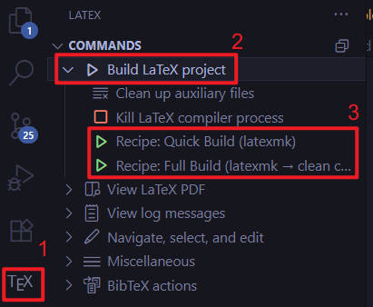
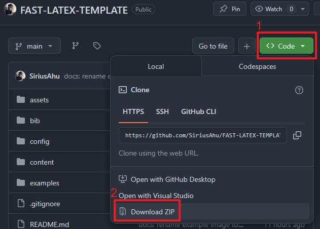
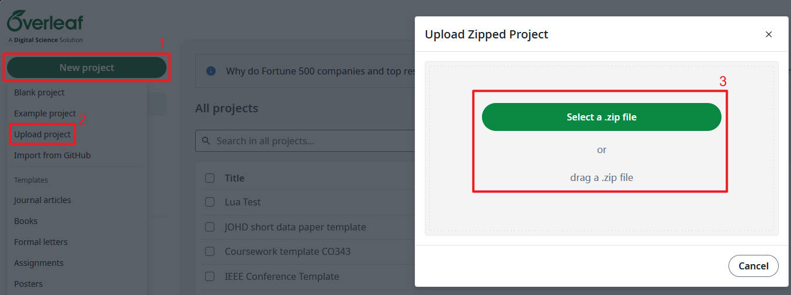

<div align="center">
  
  <h1>FAST: A Fast and Easy-to-Use LaTeX Template (for School Coursework)</h1>
</div>

<div align="center">

<!-- PDFLaTeX, Biber, BibLaTeX, listings -->


</div>

<div align="center">

[](https://www.gnu.org/licenses/gpl-3.0)

[](https://code.visualstudio.com/)

</div>

<div align="center">

[**English**](./README_EN.md) | [**简体中文**](./README.md)

</div>

# Preface: About This Project

> I first encountered LaTeX in my sophomore year and was amazed by its elegance and power.
> Since most coursework (CW) at my university requires PDF submissions, and traditional tools like Word struggle with typesetting mathematical formulas and inserting code, I decided to create a LaTeX template to help myself and my classmates produce beautiful reports more conveniently.
> 
> I took action and created a repository! It's [XJTLU-TC_Latex_Coursework_Template](https://github.com/SiriusAhu/XJTLU-TC_Latex_Coursework_Template).
> 
> However, as time passed and I gained more experience, I realized this template wasn't as user-friendly and convenient as I had hoped, and it no longer satisfied my own needs.
> 
> Therefore, with the principles of being **FAST**, **Accessible**, **Stylish**, and a **Toolkit**, I redesigned **[FAST](https://github.com/SiriusAhu/FAST-CW-LATEX-TEMPLATE)**, a brand new template!
> 
> I hope it helps you, and I hope you like it! 😉
>
> Made with [Codex](https://openai.com/codex/) and [Github Copilot](https://github.com/features/copilot)

# Introduction

**[FAST](https://github.com/SiriusAhu/FAST-CW-LATEX-TEMPLATE)** is a template designed to facilitate students' use of `LaTeX` for coursework report writing. It supports both local and online platforms (such as `Overleaf`), supports bilingual content, is easy to get started with, and works out of the box.

[Click here to jump to Usage Instructions](#usage-instructions).

## Main Features

- [x] Supports common core requirements such as mathematical formulas, table drawing, code highlighting, and references
- [x] Modular design for easy customization and extension
- [x] Simple configuration requirements, ready to use out of the box
- [x] Supports both local and online platforms (such as `Overleaf`)

## Supported Compilation Environments

- ✅ Local TeX Live / MiKTeX distributions (using `pdfLaTeX`)
- ✅ `Overleaf` platform (select `pdfLaTeX` compiler in the menu)
- ⚠️ The template is only adapted for `pdfLaTeX`; if you need `XeLaTeX`, `LuaLaTeX`, or other engines, please extend the configuration yourself

<!-- TODO: Add effect images -->

## **FAST** Philosophy

This project is based on:

- **Fast**: Core — Quick compilation!
    > No more wasting time looking for templates! Use it and start writing your coursework immediately!
- **Accessible**: Ready to use out of the box, easy to get started!
    > Compatible with most environments, provides custom commands, and directly usable `VSCode` configurations!
- **Stylish**: Beautiful, no words needed!
    > Yes, feel it with your eyes, no words needed 😎
- **Toolkit**: Suitable for CW, practical, and sufficient!
    > Mathematical formulas? Three-line tables? Code highlighting? References? It has everything you need!


## Core Tools

- `PDFLaTeX`: One of the mainstream LaTeX engines, fast and highly compatible.
- `biblatex` + `biber`: Powerful reference management tool supporting various citation formats.
- `listings`: A classic, reliable, and fast code highlighting tool.
- `CJKutf8`: Simple and easy-to-use Chinese support package (optional, disabled by default).
- `cleveref`: Intelligent cross-reference tool that automatically identifies figures, tables, equations, etc.
- `booktabs`, `amsmath`, `graphicx`, etc.: A series of classic excellent packages in the default `PDFLaTeX` ecosystem.

> ⚠️ **Note**: The template supports Chinese typesetting (via the `CJKutf8` package), but it is **disabled by default** to maintain the fastest compilation speed. If you need to use Chinese, please change `\TemplateChineseSupportfalse` to `\TemplateChineseSupporttrue` in `options.tex`. Also uncomment the Chinese reference examples in `bib/references.bib`.

> ⚠️ **Note**: The template supports drawing tools like `TikZ` + `PGFPlots`, but these packages are complex and significantly increase compilation time. If needed, please manually add the relevant packages in `config/preamble.tex`.

## Project Directory Structure

```
fast-cw-latex-template/
│
├── .vscode/
│   └── settings.json       # VSCode LaTeX Workshop configuration
│
├── assets/                 # Static resources
│   ├── code/
│   │   ├── example.py
│   │   └── example.cpp
│   ├── images/
│   │   └── logo.png
│   └── coverpage.pdf       # Coursework cover page (some courses provide this)
│
├── bib/
│   └── references.bib      # References
│
├── config/
│   ├── commands.tex        # Custom commands and environments
│   ├── preamble.tex        # Package imports and global configuration
│   └── style.tex           # Visual style (colors, titles, headers, footers)
│
├── content/
│   ├── 01-introduction.tex
│   ├── 03-math.tex
│   ├── 04-figures.tex
│   ├── 05-tables.tex
│   ├── 07-code.tex
│   ├── 08-references.tex
│   └── appendix.tex
│
├── docs/                   # Documentation (to be completed)
├── examples/               # Example files (to be completed)
├── .gitignore              # Git ignore file
├── LICENSE                 # License (GPLv3)
│
├── main.pdf                # Output PDF
├── main.tex                # Main entry file
├── meta.tex                # Meta information (title/author/date/abstract, etc.)
├── options.tex             # User options (theme color, code style, etc.)
│
├── README_EN.md            # Documentation (English)
└── README.md               # Documentation (Chinese)
```

# Usage Instructions

This project supports both local compilation (recommended with `VSCode`) and online platform compilation (such as `Overleaf`).

## A. Local Use with VSCode

### A.0.1. Environment Check
<!-- TODO: Test complete installation process on Windows and Linux using virtual machines -->

First, verify that `TeX Live` and core tools are already installed on your device.

```bash
tex --version  # Verify TeX Live is successfully installed

pdflatex --version  # Verify PDFLaTeX is successfully installed

biber --version  # Verify Biber is successfully installed
```

If not installed, please install [**TeX Live 2024**](https://www.tug.org/texlive/) or a newer version (older versions have not been tested).

<!-- TODO: Test and adapt for Overleaf -->
<!-- > But don't worry, this project also supports use on `Overleaf` (a popular online `LaTeX` editor). -->

### A.0.2. VSCode Configuration

This project comes with a `.vscode/settings.json` configuration file. If you use `VSCode` as your editor, it will directly override the default user configuration and take effect. (So you don't waste time on various additional configurations! 😎)

> Q: What if I don't want to use your configuration?
> 
> A: If you have your own configuration and don't want to use the one in the repository, you can choose to delete the `.vscode` folder or rename it (such as `.vscode_backup`). This way it won't override the default user configuration.

### 1. Clone or Download This Project

```bash
git clone https://github.com/SiriusAhu/FAST-LATEX-TEMPLATE.git
cd FAST-LATEX-TEMPLATE
```

Or download the ZIP package directly and extract it.

### 2. Edit `meta.tex` and `options.tex`

Modify according to your needs.
- `meta.tex`: Fill in the meta information of the coursework, including but not limited to:
    - Course code
    - Course name
    - Author name
    - Author student ID
    - Coverpage path
    - Cover page image path and size
    - Abstract
- `options.tex`: Adjust the following settings according to personal preferences:
    - Theme color, code style, and other options
    - **Chinese support**: If you need to use Chinese, change `\TemplateChineseSupportfalse` to `\TemplateChineseSupporttrue`

### 3. Try Compiling

Try to see if compilation is successful: Are there any rendering errors? Is the meta information in the output PDF file consistent with what you filled in `meta.tex`?

#### 3.1. Compile Using Command Line

Compilation chain: `PDFLaTeX -> Biber -> PDFLaTeX -> PDFLaTeX`.

```bash
pdflatex main.tex
biber main
pdflatex main.tex
pdflatex main.tex
```

#### 3.2. Compile Using VSCode

Install the `LaTeX Workshop` extension, then use `VSCode` to open the project folder, click the `TeX` icon in the left extension bar, select `Full Build` under `Build LaTeX project` to compile.



## B. Online Use with Overleaf

> **[FAST](https://github.com/SiriusAhu/FAST-CW-LATEX-TEMPLATE)** will be uploaded to `Overleaf`'s official template repository ([Overleaf Gallery](https://www.overleaf.com/gallery)) after initial completion, and you will be able to use it directly on `Overleaf`.
> 🚧 Currently still in testing phase.

You can download this project as a compressed package and then upload it to `Overleaf`. (See the following two images)





## Everything is Ready, Start Writing!

> 🎉 **[FAST](https://github.com/SiriusAhu/FAST-CW-LATEX-TEMPLATE)** provides two recipes (build processes) in the `VSCode` environment. The default is `Full Build`, which is slightly slower but comprehensive. If you care about speed, you can manually switch to `Quick Build`, which has no reference support (images, literature), but is very fast.

**[FAST](https://github.com/SiriusAhu/FAST-CW-LATEX-TEMPLATE)** uses a modular design. The main section content is placed in the `content/` folder, and they are all called by the `main.tex` file.

For example, a `content/01-introduction.tex` file can be called in `main.tex` with the following code:

```latex
\input{content/01-introduction.tex}
```

The files under `content` are not fixed. You can add, delete, and rename these files as needed and make corresponding calls in `main.tex`.


## Custom Commands

TODO: Create dedicated documentation for custom commands and jump links

# Q&A
- Why use `PDFLaTeX` instead of `XeLaTeX`, or `LuaLaTeX` which is touted as "the future direction"?
    1. Pursuit of **speed**: Students need to compile frequently while doing coursework. Among the mainstream engines, `PDFLaTeX` is the fastest.
    1. Pursuit of **compatibility**: `PDFLaTeX` is a mature engine with excellent support from both local and online tools (such as `Overleaf`).
    1. Pursuit of **ease of use**: The purpose of creating this template is to make it convenient for more students to use LaTeX. Considering installation difficulty and usage difficulty, `PDFLaTeX` is undoubtedly the most suitable choice.
- Why still choose `biblatex + biber` instead of the faster `bibtex`?
    1. **Advanced functionality**: The combination of `biblatex` and `biber` supports more complex citation styles (such as APA7, IEEE, GB/T 7714) and can easily handle modern literature needs such as Chinese, special characters, DOI, and URL.
    2. **Mainstream trend in academic writing**: Although compilation is slightly slower, `biblatex + biber` is already the mainstream trend in modern academic writing and is supported by major journals and templates.
    3. **Does not affect user experience**: Although compilation is relatively slow, it still only takes a few seconds and is still acceptable. Moreover, after writing for so long, why not use these precious few seconds to catch your breath? 😉
- Why use `listings` instead of `minted`?
    1. **Simpler installation and use**: `minted` depends on Python and Pygments, requiring additional operations for installation and configuration, which does not align with this project's principle of "ease of use". `listings` works out of the box.
    2. **Faster compilation**: `minted` needs to call external programs during compilation, causing slower compilation. `listings` is a pure LaTeX package with faster compilation speed.

# Known Issues
1. "The configuration file clearly uses the recipe under `.vscode/settings.json` and is set to auto-compile on save. But I find that every time I save, the system uses a different recipe to compile. What's going on?"
    - Diagnosis: You may have already made settings related to `"latex-workshop.latex.recipe.default"` in the default configuration file.
    - Solution: Change `"latex-workshop.latex.recipe.default"` in the configuration file to `"lastUsed"` (does not affect use in other projects), or comment it out directly (may affect use in other projects).
2. "Why is there no reference in the PDF file after I compile? (using `VSCode`)"
    - Diagnosis: You may be using the default recipe provided by the project, "Quick Build", which does not include the `biber` call.
    - Solution: Just manually click and select the `Full Build` recipe in the extension bar to compile.

# TODO
- [x] Modularize the `LaTeX` template
- [x] Complete English `README.md`
- [ ] Create `docs` folder to place documentation and examples
- [ ] Provide some pseudo-coursework examples to demonstrate potential (welcome to use this template and submit PRs to examples!)